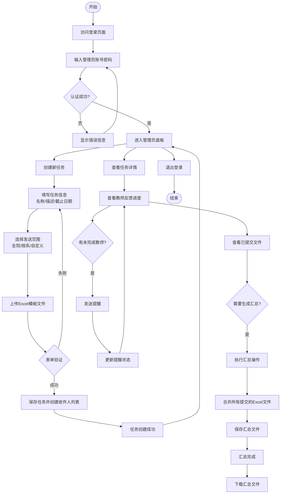
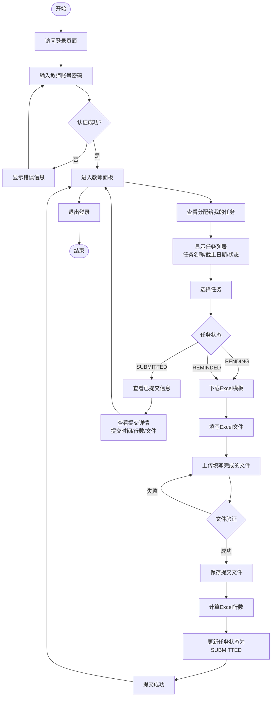
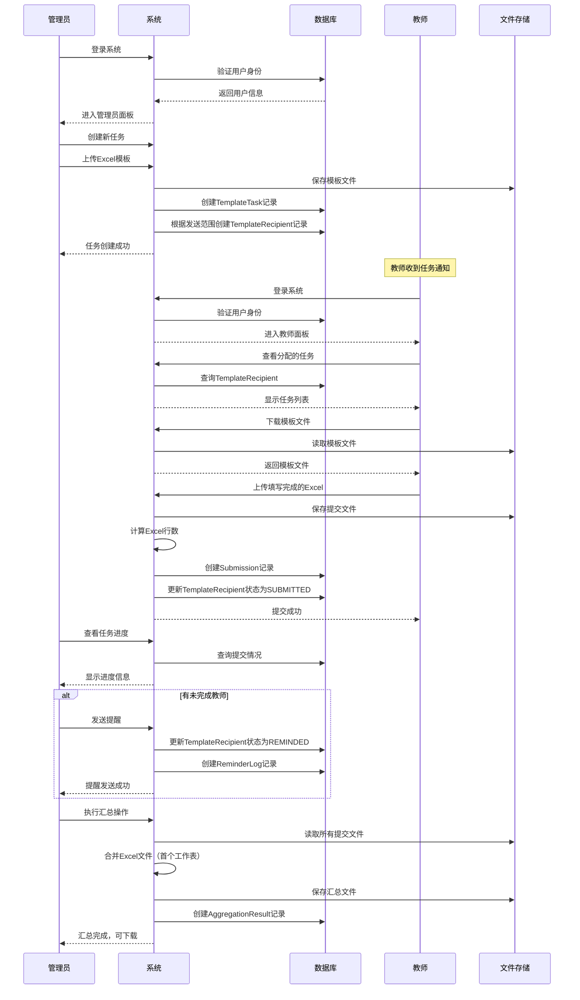
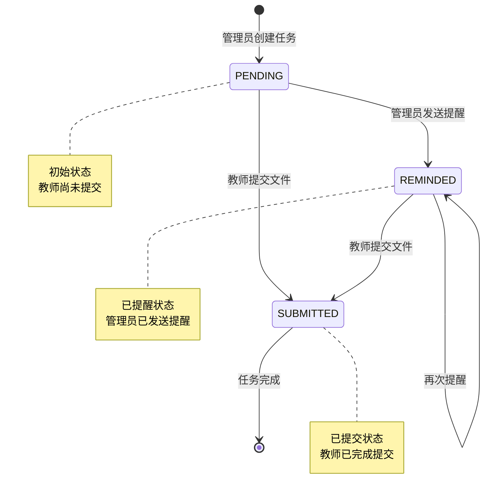
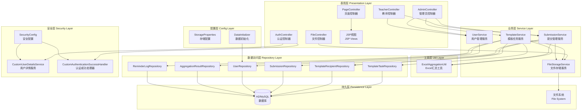
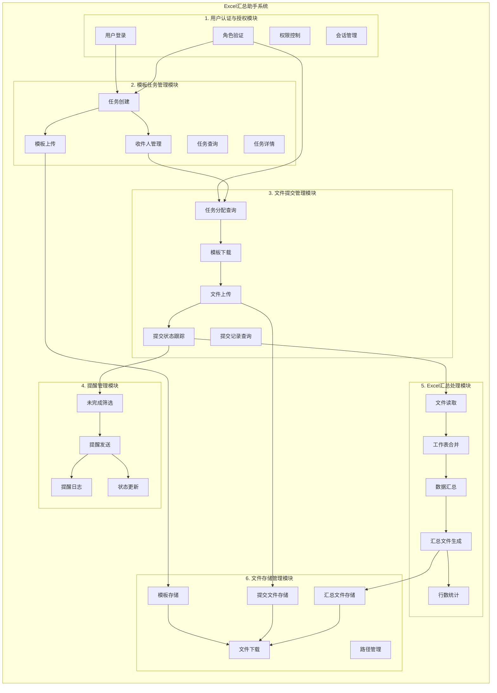
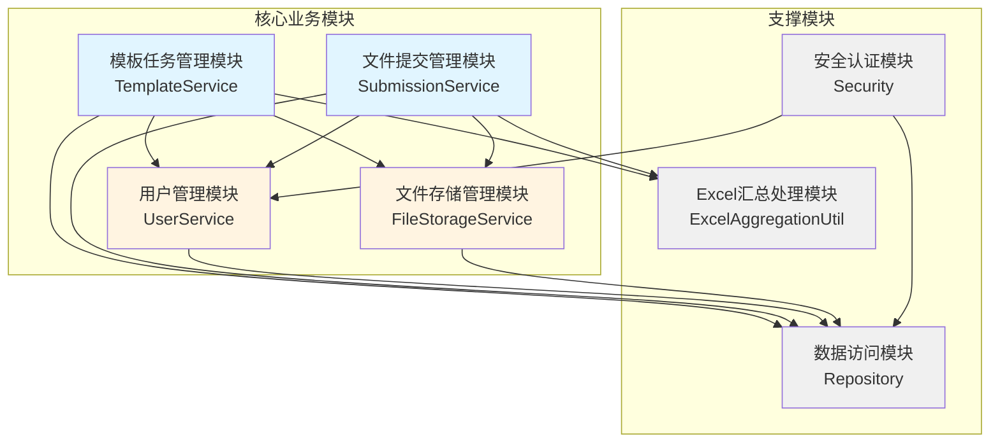
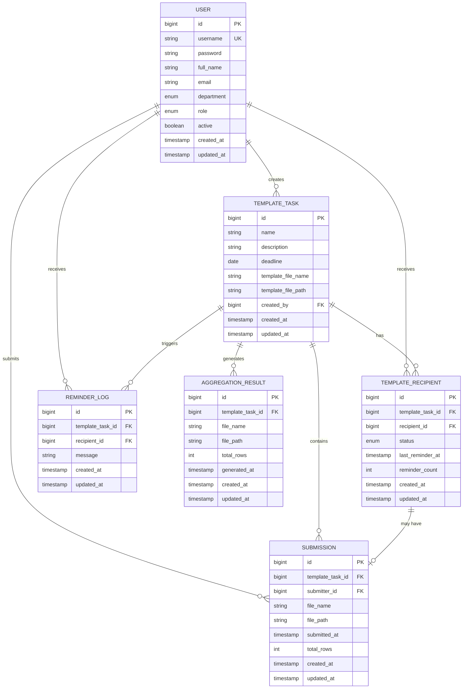

# Excel汇总助手系统 - 技术报告

## 1. 系统概述

### 1.1 系统简介

Excel汇总助手系统（excelHelper）是一个基于Spring Boot框架开发的Web应用系统，旨在为科研秘书提供便捷的Excel文件收集、管理和汇总功能。系统通过模板任务发布、教师文件提交、自动汇总等核心功能，实现了从任务发布到数据汇总的完整工作流程，有效提升了科研数据收集与管理的效率。

### 1.2 系统定位

本系统主要面向教育科研机构，特别是需要定期收集和汇总教师提交的Excel数据文件的场景。系统通过角色权限管理，区分管理员（科研秘书）和教师两类用户，为不同角色提供差异化的功能界面和操作权限。

### 1.3 核心功能

系统主要包含以下核心功能模块：

1. **用户认证与权限管理**
   - 基于Spring Security的安全认证机制
   - 支持管理员（ADMIN）和教师（TEACHER）两种角色
   - 基于角色的访问控制（RBAC）

2. **模板任务管理**
   - 管理员可创建汇总任务，上传Excel模板文件
   - 支持任务名称、描述、截止日期等元数据管理
   - 灵活的发送范围设置（全院/按系/自定义教师）

3. **文件提交与跟踪**
   - 教师可查看分配给自己的任务并下载模板
   - 支持在线提交填写完成的Excel文件
   - 实时跟踪提交状态和进度

4. **提醒功能**
   - 管理员可一键提醒未完成任务的教师
   - 记录提醒日志，支持多次提醒

5. **Excel文件汇总**
   - 自动合并多个教师提交的Excel文件
   - 基于Apache POI实现首个工作表的智能合并
   - 生成汇总文件并记录汇总结果

6. **文件存储与管理**
   - 分类存储模板、提交文件和汇总文件
   - 统一的文件下载接口，保障文件访问安全

### 1.4 技术架构

系统采用前后端分离的架构设计：

- **后端技术栈**：Spring Boot 3.2.5、Spring MVC、Spring Data JPA、Spring Security
- **前端技术栈**：JSP + JSTL、CSS
- **数据处理**：Apache POI 5.2.5（Excel文件处理）
- **数据存储**：支持H2内存数据库和MySQL数据库
- **开发语言**：Java 17

### 1.5 系统特点

1. **易用性**：简洁直观的用户界面，操作流程清晰
2. **安全性**：完善的用户认证和权限控制机制
3. **可扩展性**：模块化设计，便于功能扩展和维护
4. **可靠性**：完善的异常处理和文件管理机制
5. **高效性**：自动化汇总功能，减少人工操作

### 1.6 应用场景

系统适用于以下典型场景：

- 科研项目数据收集与汇总
- 教学评估数据收集
- 年度考核材料收集
- 各类统计报表的集中收集与整理
- 其他需要批量收集Excel文件并汇总的场景

---

## 2. 用户使用流程

### 2.1 管理员使用流程



### 2.2 教师使用流程



### 2.3 完整业务流程



### 2.4 状态流转图



---

## 3. 系统结构

### 3.1 系统整体架构

系统采用经典的分层架构设计，从上到下分为表现层、业务层、数据访问层和持久层。



### 3.2 功能模块结构

系统按功能划分为六大核心模块，各模块职责明确，相互协作。



### 3.3 模块依赖关系



### 3.4 实体关系结构



### 3.5 文件存储结构

```mermaid
graph TD
    ROOT[uploads/] --> T[templates/<br/>模板文件存储]
    ROOT --> S[submissions/<br/>提交文件存储]
    ROOT --> A[aggregations/<br/>汇总文件存储]
    
    T --> T1[任务名称-时间戳.xlsx]
    
    S --> S1[task-{id}/]
    S1 --> S2[user-{id}/]
    S2 --> S3[submission-时间戳.xlsx]
    
    A --> A1[任务名称-汇总-时间戳.xlsx]
    
    style ROOT fill:#e1f5ff
    style T fill:#fff4e1
    style S fill:#fff4e1
    style A fill:#fff4e1
```

### 3.6 控制器路由结构

```mermaid
graph TB
    ROOT[/] --> LOGIN[/login<br/>登录页面]
    ROOT --> ADMIN[/admin/**<br/>管理员功能]
    ROOT --> TEACHER[/teacher/**<br/>教师功能]
    ROOT --> FILES[/files<br/>文件下载]
    
    ADMIN --> AD1[/admin/dashboard<br/>管理员面板]
    ADMIN --> AD2[/admin/templates<br/>创建任务]
    ADMIN --> AD3[/admin/templates/{id}<br/>任务详情]
    ADMIN --> AD4[/admin/templates/{id}/remind<br/>发送提醒]
    ADMIN --> AD5[/admin/templates/{id}/aggregate<br/>执行汇总]
    
    TEACHER --> TE1[/teacher/dashboard<br/>教师面板]
    TEACHER --> TE2[/teacher/templates/{id}<br/>查看任务]
    TEACHER --> TE3[/teacher/templates/{id}/submit<br/>提交文件]
    
    FILES --> F1[?path=相对路径<br/>下载文件]
    
    style ROOT fill:#e1f5ff
    style ADMIN fill:#fff4e1
    style TEACHER fill:#fff4e1
    style FILES fill:#f0f0f0
```

### 3.7 模块功能详细说明

#### 3.7.1 用户认证与授权模块

| 功能名称 | 功能描述 | 实现类/组件 | 主要方法 |
|---------|---------|------------|---------|
| 用户登录认证 | 处理用户登录请求，验证用户名和密码 | `AuthController` | `login()`, `adminLogin()` |
| 用户身份加载 | 从数据库加载用户信息并转换为Spring Security用户对象 | `CustomUserDetailsService` | `loadUserByUsername()` |
| 角色验证 | 验证用户角色（ADMIN/TEACHER）并授予相应权限 | `SecurityConfig` | `securityFilterChain()` |
| 登录成功处理 | 根据用户角色自动跳转到对应的管理面板 | `CustomAuthenticationSuccessHandler` | `onAuthenticationSuccess()` |
| 权限控制 | 基于角色的URL访问控制，保护管理员和教师功能 | `SecurityConfig` | `authorizeHttpRequests()` |
| 密码加密 | 使用BCrypt算法对用户密码进行加密存储 | `SecurityConfig` | `passwordEncoder()` |
| 会话管理 | 管理用户登录会话，支持登出功能 | `SecurityConfig` | `logout()` |

#### 3.7.2 模板任务管理模块

| 功能名称 | 功能描述 | 实现类/组件 | 主要方法 |
|---------|---------|------------|---------|
| 创建任务 | 管理员创建新的汇总任务，包含任务名称、描述、截止日期等信息 | `TemplateService` | `createTask()` |
| 模板上传 | 上传Excel模板文件并保存到文件系统 | `TemplateService` | `createTask()` |
| 收件人管理 | 根据发送范围（全院/按系/自定义）自动创建任务收件人列表 | `TemplateService` | `resolveRecipients()` |
| 任务列表查询 | 查询所有已创建的任务，按创建时间倒序排列 | `TemplateService` | `findAll()` |
| 任务详情查询 | 根据任务ID查询任务详细信息 | `TemplateService` | `getById()` |
| 收件人列表查询 | 查询指定任务的所有收件人及其状态 | `TemplateService` | `findRecipients()` |
| 任务创建接口 | 处理管理员创建任务的HTTP请求，包含表单验证 | `AdminController` | `createTemplate()` |
| 任务详情展示 | 展示任务详情页面，包含进度、提交情况等信息 | `AdminController` | `templateDetail()` |

#### 3.7.3 文件提交管理模块

| 功能名称 | 功能描述 | 实现类/组件 | 主要方法 |
|---------|---------|------------|---------|
| 任务分配查询 | 查询指定教师收到的所有任务分配 | `SubmissionService` | `assignmentsFor()` |
| 文件上传 | 接收教师上传的Excel文件并保存 | `SubmissionService` | `submit()` |
| 权限验证 | 验证教师是否有权限提交指定任务 | `SubmissionService` | `submit()` |
| Excel行数统计 | 统计上传的Excel文件首个工作表的行数 | `SubmissionService` | `countRows()` |
| 提交状态更新 | 教师提交文件后，更新收件人状态为SUBMITTED | `SubmissionService` | `submit()` |
| 提交记录查询 | 查询指定任务的所有提交记录 | `SubmissionService` | `findByTemplate()` |
| 提交接口 | 处理教师提交文件的HTTP请求 | `TeacherController` | `submit()` |
| 任务列表展示 | 在教师面板展示分配的任务列表 | `TeacherController` | `dashboard()` |

#### 3.7.4 提醒管理模块

| 功能名称 | 功能描述 | 实现类/组件 | 主要方法 |
|---------|---------|------------|---------|
| 未完成筛选 | 筛选出指定任务中尚未提交的教师 | `TemplateService` | `remindPending()` |
| 提醒发送 | 批量更新未完成教师的状态为REMINDED | `TemplateService` | `remindPending()` |
| 提醒日志记录 | 记录每次提醒操作，包含提醒消息和时间 | `TemplateService` | `remindPending()` |
| 状态更新 | 更新收件人的提醒状态、最后提醒时间和提醒次数 | `TemplateService` | `remindPending()` |
| 提醒接口 | 处理管理员发送提醒的HTTP请求 | `AdminController` | `remind()` |

#### 3.7.5 Excel汇总处理模块

| 功能名称 | 功能描述 | 实现类/组件 | 主要方法 |
|---------|---------|------------|---------|
| 文件读取 | 读取所有已提交的Excel文件 | `TemplateService` | `aggregate()` |
| 工作表合并 | 合并多个Excel文件的首个工作表，自动跳过重复的表头 | `ExcelAggregationUtil` | `mergeFirstSheet()` |
| 数据汇总 | 将所有提交文件的数据行合并到一个汇总文件中 | `ExcelAggregationUtil` | `mergeFirstSheet()` |
| 汇总文件生成 | 生成新的汇总Excel文件并保存 | `TemplateService` | `aggregate()` |
| 行数统计 | 统计汇总文件的总行数 | `ExcelAggregationUtil` | `mergeFirstSheet()` |
| 单元格复制 | 复制源文件的单元格数据（支持字符串、数字、布尔值、公式等类型） | `ExcelAggregationUtil` | `copyRow()` |
| 汇总记录保存 | 保存汇总结果到数据库，包含文件路径、行数等信息 | `TemplateService` | `aggregate()` |
| 最新汇总查询 | 查询指定任务的最新汇总结果 | `TemplateService` | `latestAggregation()` |
| 汇总接口 | 处理管理员执行汇总操作的HTTP请求 | `AdminController` | `aggregate()` |

#### 3.7.6 文件存储管理模块

| 功能名称 | 功能描述 | 实现类/组件 | 主要方法 |
|---------|---------|------------|---------|
| 模板存储 | 存储上传的Excel模板文件，文件名包含任务名称和时间戳 | `FileStorageService` | `storeTemplate()` |
| 提交文件存储 | 按任务ID和用户ID分类存储教师提交的文件 | `FileStorageService` | `storeSubmission()` |
| 汇总文件存储 | 存储生成的汇总文件，文件名包含任务名称和汇总标识 | `FileStorageService` | `createAggregationFile()` |
| 文件下载 | 提供统一的文件下载接口，通过相对路径安全访问文件 | `FileController` | `download()` |
| 路径管理 | 管理文件的相对路径和绝对路径之间的转换 | `FileStorageService` | `toRelative()`, `resolvePath()` |
| 目录创建 | 自动创建必要的存储目录结构 | `FileStorageServiceImpl` | 构造函数 |
| 文件名安全化 | 对文件名进行安全处理，移除特殊字符 | `FileStorageServiceImpl` | `sanitize()` |
| 文件存储配置 | 配置文件存储的根目录和各类文件的子目录 | `StorageProperties` | 配置属性 |

#### 3.7.7 用户管理模块

| 功能名称 | 功能描述 | 实现类/组件 | 主要方法 |
|---------|---------|------------|---------|
| 用户查询 | 根据用户名查询用户信息 | `UserService` | `findByUsername()` |
| 教师列表查询 | 查询所有教师用户 | `UserService` | `findTeachers()` |
| 按系查询教师 | 根据系别查询该系的所有教师 | `UserService` | `findTeachersByDepartment()` |
| 用户初始化 | 系统启动时初始化默认管理员和教师账号 | `DataInitializer` | `run()` |

#### 3.7.8 页面控制模块

| 功能名称 | 功能描述 | 实现类/组件 | 主要方法 |
|---------|---------|------------|---------|
| 首页重定向 | 根据用户登录状态和角色自动跳转到相应页面 | `PageController` | `index()` |
| 登录页面 | 提供用户登录界面 | `AuthController` | `login()`, `adminLogin()` |
| 管理员面板 | 展示管理员功能界面，包含任务创建和任务列表 | `AdminController` | `dashboard()` |
| 教师面板 | 展示教师功能界面，包含任务列表和提交功能 | `TeacherController` | `dashboard()` |
| 任务详情页 | 展示任务详细信息，包含进度、提交情况、汇总结果等 | `AdminController` | `templateDetail()` |

#### 3.7.9 数据访问模块

| 功能名称 | 功能描述 | 实现类/组件 | 主要方法 |
|---------|---------|------------|---------|
| 任务数据访问 | 提供模板任务的CRUD操作 | `TemplateTaskRepository` | `findAll()`, `findById()`, `save()` |
| 收件人数据访问 | 提供任务收件人的查询和更新操作 | `TemplateRecipientRepository` | `findByTemplateTaskId()`, `findByRecipientId()` |
| 提交数据访问 | 提供提交记录的查询和保存操作 | `SubmissionRepository` | `findByTemplateTaskId()`, `findByTemplateTaskIdAndSubmitterId()` |
| 用户数据访问 | 提供用户信息的查询操作 | `UserRepository` | `findByUsername()`, `findAllByRole()` |
| 汇总结果数据访问 | 提供汇总结果的查询和保存操作 | `AggregationResultRepository` | `findTopByTemplateTaskIdOrderByCreatedAtDesc()`, `save()` |
| 提醒日志数据访问 | 提供提醒日志的保存操作 | `ReminderLogRepository` | `save()` |

---

*本报告将逐步补充系统设计、技术实现、部署运维等详细内容。*

